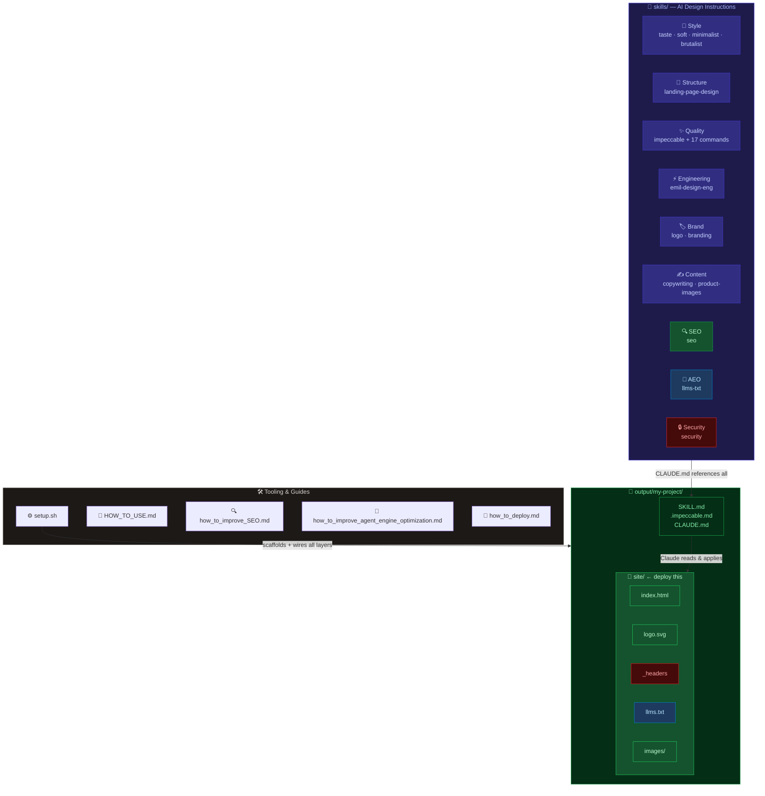

<div align="center">

# 🎨 Front-End Tech

**A toolkit for building landing pages and websites for apps, ideas, and concepts — powered by AI design skills.**


<br/>

*Every page is automatically* ***secured*** *·* ***SEO-optimized*** *·* ***AEO-ready for AI search*** *— without you asking.*

</div>

---

## 🗺️ Architecture



---

## 🧱 Skill Layers

Every project uses all 9 layers simultaneously — they cover different concerns and never conflict.

```mermaid
graph LR
    A["📐 Structure<br/><small>landing-page-design</small>"]:::structure
    B["🎨 Style<br/><small>taste · soft · minimalist · brutalist</small>"]:::style
    C["✨ Quality<br/><small>impeccable + 17 cmds</small>"]:::quality
    D["⚡ Engineering<br/><small>emil-design-eng</small>"]:::engineering
    E["🏷️ Brand<br/><small>logo · branding</small>"]:::brand
    F["✍️ Content<br/><small>copy · product-images</small>"]:::content
    G["🔍 SEO<br/><small>meta · JSON-LD · speed</small>"]:::seo
    H["🤖 AEO<br/><small>llms.txt · AI search</small>"]:::aeo
    I["🔒 Security<br/><small>headers · SRI · safe links</small>"]:::security

    A --> B --> C --> D --> E --> F --> G --> H --> I

    classDef structure fill:#312e81,color:#c7d2fe,stroke:#4338ca
    classDef style fill:#4a1d96,color:#e9d5ff,stroke:#7c3aed
    classDef quality fill:#134e4a,color:#99f6e4,stroke:#0d9488
    classDef engineering fill:#0c4a6e,color:#bae6fd,stroke:#0284c7
    classDef brand fill:#713f12,color:#fef08a,stroke:#ca8a04
    classDef content fill:#1e3a5f,color:#bfdbfe,stroke:#3b82f6
    classDef seo fill:#14532d,color:#bbf7d0,stroke:#16a34a
    classDef aeo fill:#1e3a5f,color:#bae6fd,stroke:#0ea5e9
    classDef security fill:#450a0a,color:#fca5a5,stroke:#dc2626
```

> All layers are wired automatically by `setup.sh` + `CLAUDE.md` — you only need to pick a style.

---

## 📁 Project Structure

```
output/my-product/
├── 📄 SKILL.md           ← active style skill    ┐
├── 📄 .impeccable.md     ← quality layer          ├── Claude reads (never deployed)
├── 📄 CLAUDE.md          ← all layer references  ┘
│
└── 🚀 site/              ← drag this to Cloudflare Pages
    ├── 📄 index.html     ← your page
    ├── 🖼️  logo.svg       ← logo
    ├── 🔒 _headers       ← security headers (auto-created)
    ├── 🤖 llms.txt       ← AI search optimization
    ├── 🗺️  robots.txt     ← crawler rules
    ├── 🗺️  sitemap.xml    ← site map
    └── 📸 images/        ← product screenshots
```

---

## 🎯 Skills

### 🎨 Style — Pick ONE

| Skill | Best for |
|-------|----------|
| [**taste-skill**](https://github.com/Leonxlnx/taste-skill) | General-purpose modern UI — SaaS, apps, landing pages |
| [**soft-skill**](https://github.com/Leonxlnx/taste-skill) | Premium agency-level feel — luxury, high-end products |
| [**minimalist-skill**](https://github.com/Leonxlnx/taste-skill) | Editorial, content-heavy — Notion/Linear inspired |
| [**brutalist-skill**](https://github.com/Leonxlnx/taste-skill) | Bold, raw — Swiss typographic / CRT terminal |

### 🔧 Always Applied (automatic)

| Layer | Skill | What it does |
|-------|-------|-------------|
| 📐 Structure | [landing-page-design](https://github.com/vibeforge1111/vibeship-spawner-skills) | Hero formulas, section stacks, conversion patterns |
| ✨ Quality | [impeccable](https://github.com/pbakaus/impeccable) | 17 commands, anti-patterns, accessibility |
| ⚡ Engineering | [emil-design-eng](https://github.com/emilkowalski/skill) | Animation craft, transforms, gestures |
| 🏷️ Brand | logo + [branding](https://github.com/vibeforge1111/vibeship-spawner-skills) | Asks for logo, places correctly, or creates SVG wordmark |
| ✍️ Content | [copywriting](https://github.com/vibeforge1111/vibeship-spawner-skills) + product-images | Copy frameworks, browser frames, phone mockups, perspective tilts |
| 🔍 SEO | seo | Meta tags, Open Graph, JSON-LD, semantic HTML, page speed |
| 🤖 AEO | llms-txt | `llms.txt`, speakable schema, AI search copy rules |
| 🔒 Security | security | Cloudflare `_headers`, SRI on CDN scripts, no-secrets policy, safe links |

---

## ⚡ Quick Start

```bash
# 1. Clone the repo
git clone https://github.com/AnanyaBanerjee/front-end-tech.git
cd front-end-tech

# 2. Scaffold a new project with ALL layers wired up automatically
./setup.sh my-landing-page taste-skill
#           ^               ^
#           project name    style: taste-skill · soft-skill · minimalist-skill · brutalist-skill

# 3. Open Claude Code in the project folder and start building
cd output/my-landing-page
```

Claude will ask for your **logo**, **screenshots**, and **product description** before writing a line of code.

### ♻️ Redesign an existing page

```bash
./setup.sh existing-project taste-skill
cd output/existing-project
```

Then prompt Claude:
```
Redesign this page following all loaded design skills. Audit the current
page against the landing-page-design structure first — check the hero
formula, section stack, and anti-patterns. Tell me what you're changing
and why before you rewrite anything.
```

---

## 🚀 Deploy

> Drag the `site/` folder to **[Cloudflare Pages](https://pages.cloudflare.com)** — free, unlimited bandwidth, custom domains.

The `_headers` file is already inside `site/` — Cloudflare picks it up automatically and applies your security headers to every response.

See **[how_to_deploy.md](how_to_deploy.md)** for step-by-step instructions, custom domain setup, and post-deploy Cloudflare security settings.

---

## 📚 Guides

| | Guide | What it covers |
|-|-------|---------------|
| 📖 | [HOW_TO_USE.md](HOW_TO_USE.md) | Prompt examples, skill layering, impeccable commands, full workflow |
| 🔍 | [how_to_improve_SEO.md](how_to_improve_SEO.md) | SEO from scratch — what Claude does, what you provide, timeline |
| 🤖 | [how_to_improve_agent_engine_optimization.md](how_to_improve_agent_engine_optimization.md) | AEO, llms.txt, how AI search engines read your page |
| 🚀 | [how_to_deploy.md](how_to_deploy.md) | Cloudflare Pages, custom domains, DNS, security settings |

---

## 🙏 Credits

- **taste-skill · soft-skill · minimalist-skill · brutalist-skill** — by [Leonxlnx](https://github.com/Leonxlnx) · [source](https://github.com/Leonxlnx/taste-skill)
- **impeccable** — by [pbakaus](https://github.com/pbakaus) · [source](https://github.com/pbakaus/impeccable) · Apache 2.0
- **emil-design-eng** — by [Emil Kowalski](https://github.com/emilkowalski) · [source](https://github.com/emilkowalski/skill)
- **landing-page-design · branding · copywriting** — [vibeship-spawner-skills](https://github.com/vibeforge1111/vibeship-spawner-skills)
- **logo · product-images · seo · llms-txt · security** — custom skills written for this repo
